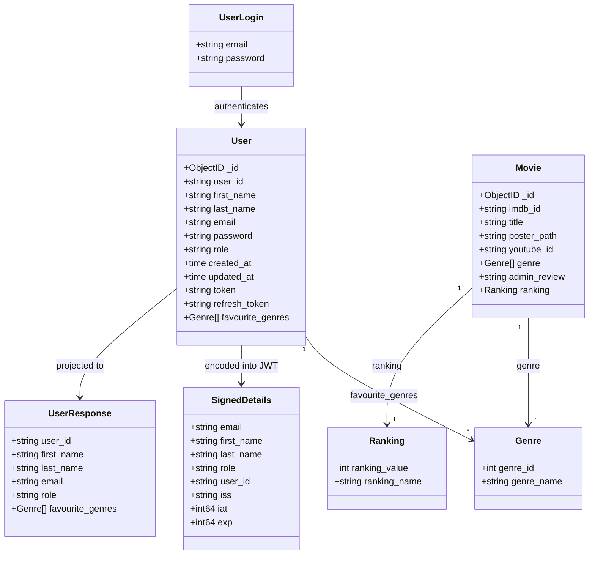
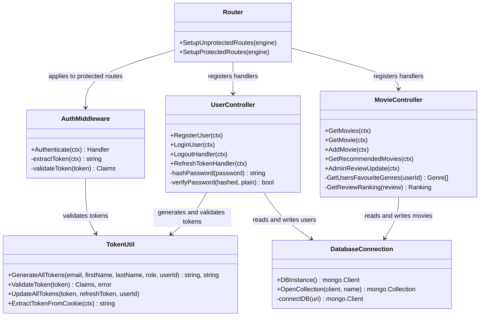
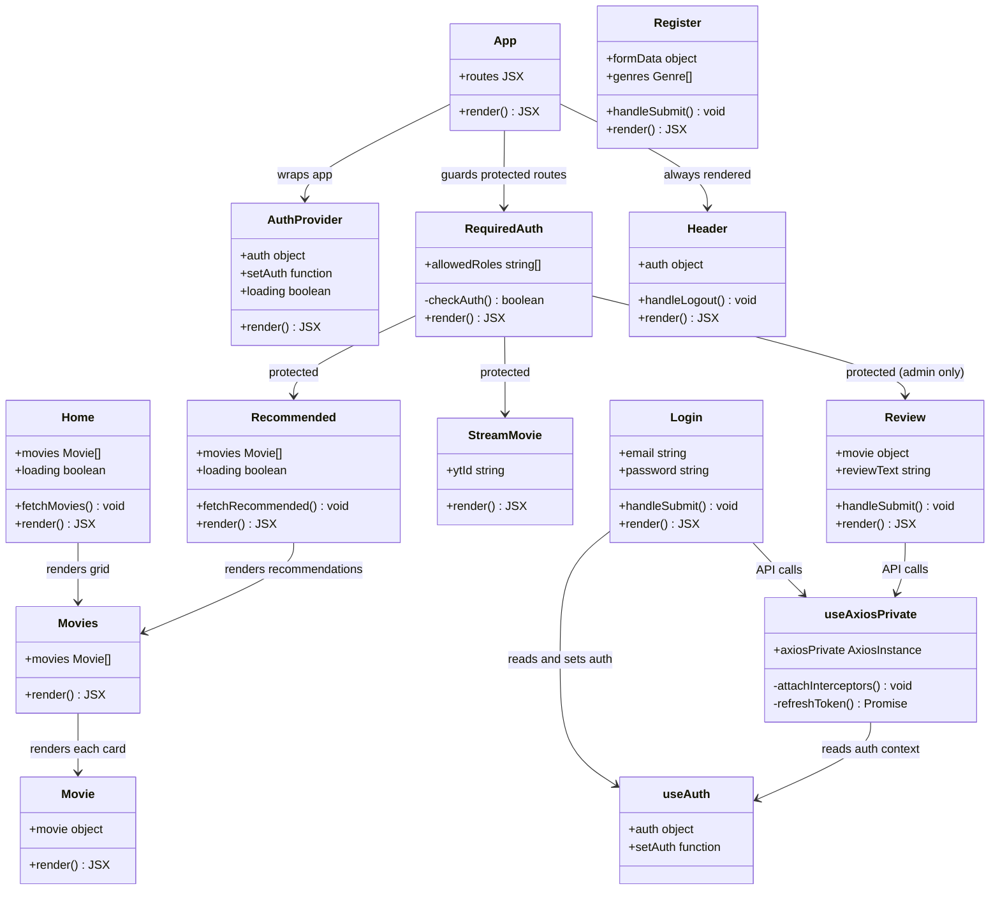
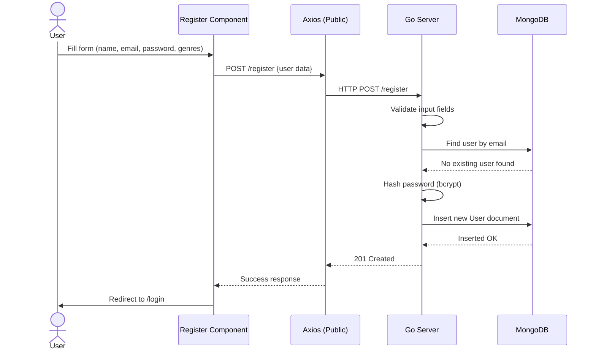
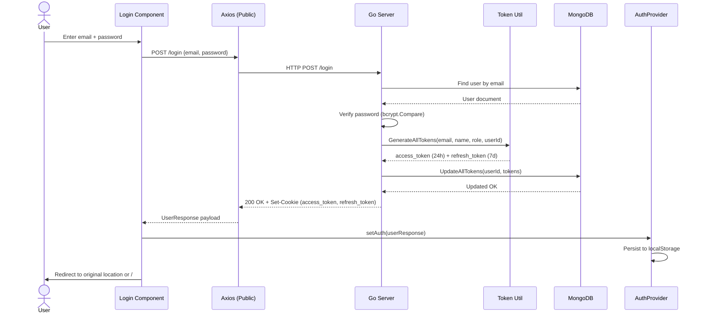
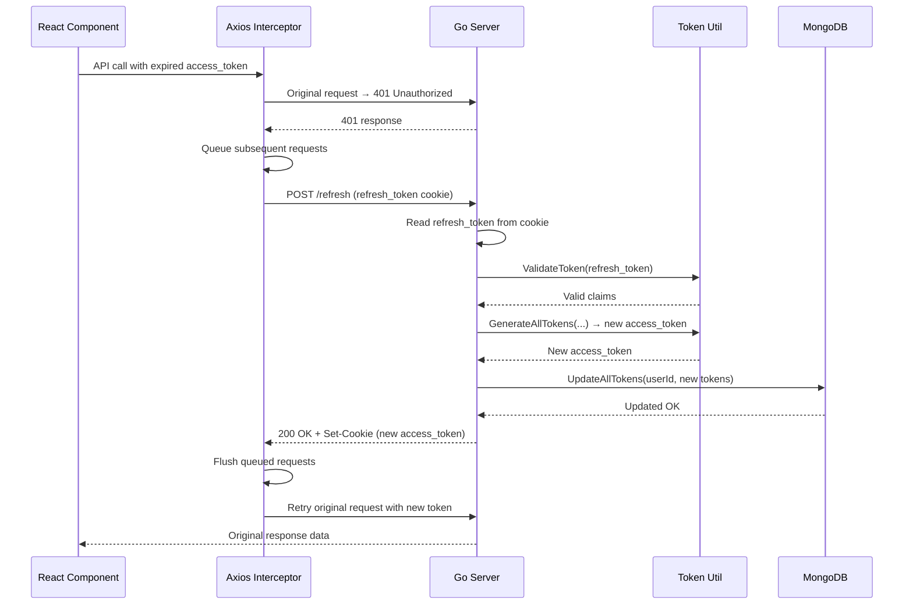
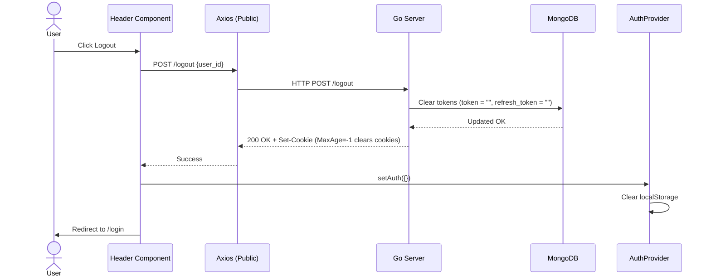
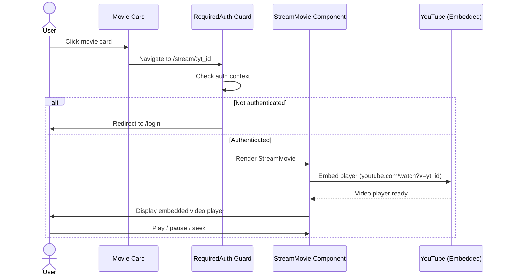
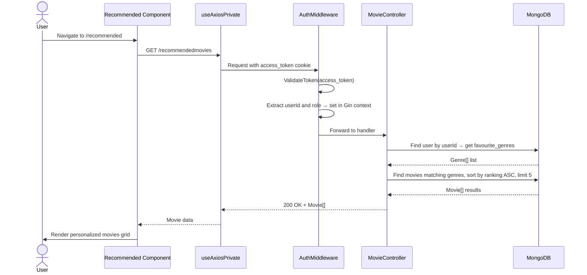
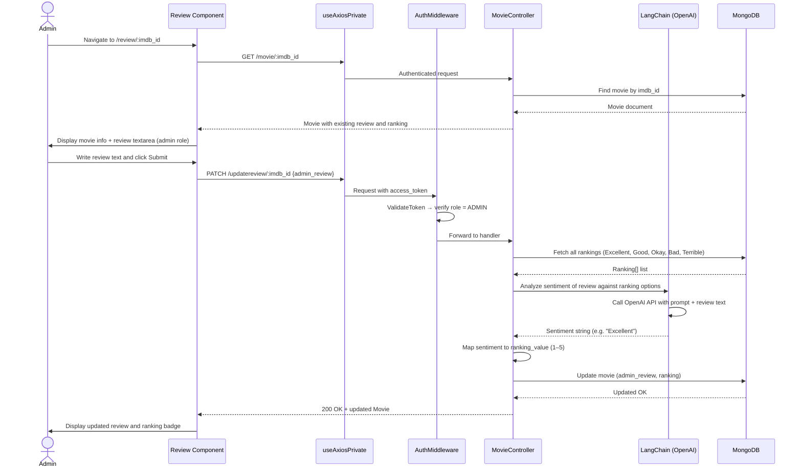

# StreamSense 🎬

A full-stack movie streaming and discovery platform with personalized recommendations, user reviews, and JWT-secured authentication.

Built with a **React + Vite** frontend and a **Go (Gin)** backend, backed by **MongoDB**.

---

## Features

- **Movie Browsing** — explore a curated catalog of movies with posters and metadata
- **Movie Streaming** — watch embedded YouTube trailers via React Player
- **User Authentication** — register, login, and logout with JWT tokens stored in HTTP-only cookies
- **Personalized Recommendations** — genre-based movie suggestions for authenticated users
- **User Reviews** — authenticated users can view and admins can update movie reviews/rankings
- **Protected Routes** — frontend route guards and backend middleware both enforce auth

---

## Tech Stack

| Layer      | Technology                          |
|------------|-------------------------------------|
| Frontend   | React 19, Vite, React Router DOM 7  |
| UI         | React Bootstrap, FontAwesome        |
| HTTP       | Axios (with cookie support)         |
| Video      | React Player (YouTube embed)        |
| Backend    | Go 1.24, Gin Web Framework          |
| Auth       | JWT (golang-jwt v5), bcrypt         |
| Database   | MongoDB (official Go driver v2)     |
| Config     | godotenv                            |

---

## Project Structure

```
StreamSense-main/
├── Client/
│   └── magic-stream-client/   # React + Vite frontend
│       ├── src/
│       │   ├── api/           # Axios instances (public & private)
│       │   ├── context/       # Auth context provider
│       │   ├── hooks/         # useAuth, useAxiosPrivate
│       │   └── components/    # All UI components
│       └── public/
│
├── Server/
│   └── StreamSenseServer/     # Go + Gin backend
│       ├── controllers/       # Request handlers
│       ├── middleware/        # JWT auth middleware
│       ├── models/            # Data structs
│       ├── routes/            # Route registration
│       ├── utils/             # Token generation & validation
│       └── database/          # MongoDB connection
│
└── magic-stream-seed-data/    # JSON seed data for MongoDB
```

---

## Getting Started

### Prerequisites

- Node.js 18+
- Go 1.24+
- MongoDB instance (local or Atlas)

---

### Backend Setup

```bash
cd Server/StreamSenseServer
```

Create a `.env` file:

```env
MONGODB_URI=mongodb://localhost:27017
DATABASE_NAME=magicstream
SECRET_KEY=your_jwt_access_secret
SECRET_REFRESH_KEY=your_jwt_refresh_secret
ALLOWED_ORIGINS=http://localhost:5173
```

Install dependencies and run:

```bash
go mod download
go run main.go
```

Server starts on `http://localhost:8080`.

---

### Frontend Setup

```bash
cd Client/magic-stream-client
```

Create a `.env` file:

```env
VITE_API_BASE_URL=http://localhost:8080
```

Install dependencies and run:

```bash
npm install
npm run dev
```

App starts on `http://localhost:5173`.

---

### Seed the Database

Import the JSON files from `magic-stream-seed-data/` into MongoDB:

```bash
mongoimport --db magicstream --collection movies --file magic-stream-seed-data/movies.json --jsonArray
mongoimport --db magicstream --collection users --file magic-stream-seed-data/users.json --jsonArray
mongoimport --db magicstream --collection genres --file magic-stream-seed-data/genres.json --jsonArray
mongoimport --db magicstream --collection rankings --file magic-stream-seed-data/rankings.json --jsonArray
```

---

## API Reference

### Public Endpoints

| Method | Route      | Description                   |
|--------|------------|-------------------------------|
| GET    | /movies    | Fetch all movies              |
| GET    | /genres    | Fetch all genres              |
| POST   | /register  | Create a new user account     |
| POST   | /login     | Authenticate and receive JWT  |
| POST   | /logout    | Clear session cookies         |
| POST   | /refresh   | Refresh expired access token  |
| GET    | /hello     | Health check                  |

### Protected Endpoints (JWT required)

| Method | Route                      | Description                     |
|--------|----------------------------|---------------------------------|
| GET    | /movie/:imdb_id            | Get single movie details        |
| POST   | /addmovie                  | Add a new movie (admin)         |
| GET    | /recommendedmovies         | Get personalized recommendations|
| PATCH  | /updatereview/:imdb_id     | Update movie review (admin)     |

---

## Authentication Flow

1. User registers or logs in → server validates credentials and issues JWT tokens
2. Tokens are stored in HTTP-only cookies (`access_token`, `refresh_token`)
3. Frontend persists user info in `localStorage` via `AuthProvider`
4. Protected routes validate JWT via `AuthMiddleware` on the backend
5. Expired access tokens are silently refreshed using the refresh token

---

## Database Schema

### `users`
| Field             | Type     | Description              |
|-------------------|----------|--------------------------|
| user_id           | string   | Unique identifier        |
| first_name        | string   |                          |
| last_name         | string   |                          |
| email             | string   | Unique, validated        |
| password          | string   | bcrypt hashed            |
| role              | string   | `ADMIN` or `USER`        |
| favourite_genres  | []Genre  | Preferred genres         |
| token             | string   | Current access token     |
| refresh_token     | string   | Current refresh token    |

### `movies`
| Field        | Type     | Description                    |
|--------------|----------|--------------------------------|
| imdb_id      | string   | Unique movie identifier        |
| title        | string   |                                |
| poster_path  | string   | URL to poster image            |
| youtube_id   | string   | YouTube video ID for streaming |
| genre        | []string | Associated genres              |
| admin_review | string   | Admin-authored review text     |
| ranking      | Ranking  | Quality ranking object         |

---

## Scripts

### Frontend

```bash
npm run dev       # Start dev server
npm run build     # Production build → dist/
npm run preview   # Preview production build
npm run lint      # Run ESLint
```

### Backend

```bash
go run main.go    # Run server
go build          # Compile binary
```

---

## Low-Level Design (LLD)

### Class Diagrams

#### Backend Data Models



#### Backend Layer Architecture



#### Frontend Component Hierarchy



---

### Sequence Diagrams — Authentication Flows

#### User Registration



#### User Login



#### Silent Token Refresh



#### User Logout



---

### Sequence Diagrams — Feature Flows

#### Movie Streaming



#### Personalized Recommendations



#### Admin Review and Sentiment Analysis



---

## License

MIT
